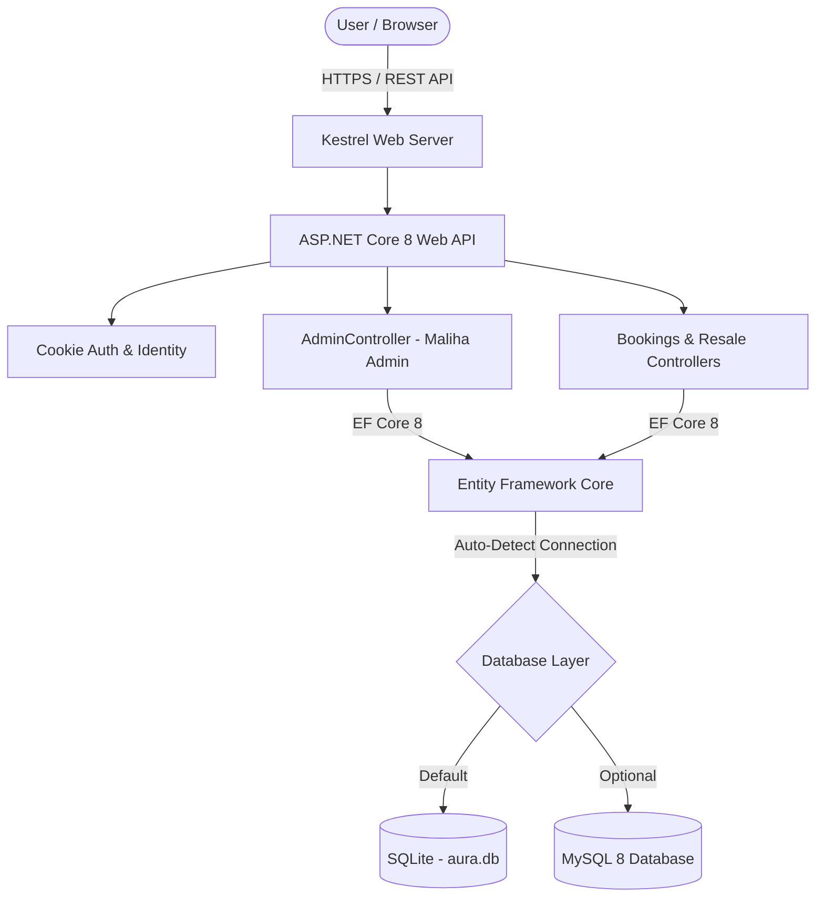

# 🎟️ AURA++ — Next-Generation Event Ticketing Platform

[](https://dotnet.microsoft.com/)
[](https://www.docker.com/)
[](LICENSE)
[]()

> A full-stack, enterprise-grade event ticketing platform featuring real-time ticket validation, ticket resale marketplace, organizer submissions, and a comprehensive **Admin Panel (Admin: Maliha Parvin)**.

---

## 🌟 Key Features

- 🛡️ **Role-Based Access & Admin Panel**:
  - **System Admin**: **Maliha Parvin** manages platform metrics, user accounts, ticket resales, pending event submissions, and **Buyers Information**.
  - **Role-Based Permissions**: Anyone entering the dashboard can inspect all records, but **only Admin Maliha can delete records or confirmation signs**.
- 💳 **Seamless Booking & Confirmation Signs**:
  - Instant ticket generation with unique QR/confirmation codes (`CONF-AURA-XXXX`).
- 🔄 **Ticket Resale Marketplace**:
  - Users can list valid tickets for secondary market resale. Admin can delete options and restore tickets to original owners.
- 🐳 **Docker Multi-Stage & CI/CD Pipeline**:
  - Complete `.github/workflows/ci-cd.yml` automation and `docker-compose.yml` supporting SQLite and MySQL 8.

---

## 🏗️ System Architecture



---

## 👥 Contributors

| Developer | Role | Responsibilities |
|---|---|---|
| **Nusrat Jahan Shanti** | **Frontend and Backend Developer** | Core UI Flow, Event Management, Authentication & C# Backend Services |
| **Maliha Parvin** | **Frontend and Backend Developer** | Admin Panel Architecture, Buyers Information, System Permissions & API Security |
| **Md Hisham Mahmud** | **Frontend and Backend Developer** | Ticket Verification, Database Schema, Resale Marketplace & Docker CI/CD |

---

## 🛠️ Technology Stack

| Layer | Technology |
|---|---|
| **Backend** | C# ASP.NET Core 8 Web API |
| **Database** | SQLite (Default) / MySQL 8 (Auto-detected) |
| **ORM** | Entity Framework Core 8 |
| **Frontend** | HTML5, Modern Vanilla CSS, Vanilla JavaScript & FontAwesome 6 |
| **Containerization** | Docker, Docker Compose |
| **CI/CD** | GitHub Actions |

---

## ⚡ Quick Start & Execution

### Option 1: Native C# .NET CLI

```powershell
# 1. Clone repository & enter directory
git clone https://github.com/maliha-noon/SD-3.2-.git
cd SD-3.2-source

# 2. Build and run the ASP.NET Core web application
dotnet run

# 3. Access in browser
# http://localhost:5000 or http://localhost:5005
```

### Option 2: Docker Compose

```bash
# Launch application with default SQLite database
docker compose up -d

# Or run with MySQL 8 environment
docker compose --profile mysql up -d
```

---

## 📑 API Endpoints (C# ASP.NET Core)

| Category | Method | Endpoint | Description | Permission |
|---|---|---|---|---|
| **Admin** | `GET` | `/api/admin/summary` | Overall platform KPIs & metrics | Admin Only |
| **Admin** | `GET` | `/api/admin/users` | All registered user accounts | All View / Admin Delete |
| **Admin** | `GET` | `/api/admin/buyers` | Ticket buyers & purchase confirmation signs | All View / Admin Delete |
| **Admin** | `DELETE` | `/api/admin/confirmation-sign/{id}` | Delete buyer confirmation sign | **Admin Maliha Only** |
| **Admin** | `GET` | `/api/admin/resale-listings` | Active selling options & resale items | All View / Admin Delete |
| **Admin** | `DELETE` | `/api/admin/resale/{id}` | Delete resale option & restore ticket | **Admin Maliha Only** |
| **Admin** | `GET` | `/api/admin/submissions` | Pending event organizer submissions | Admin Only |
| **Auth** | `POST` | `/api/auth/login` | User authentication | Public |
| **Auth** | `POST` | `/api/auth/register` | Account registration | Public |
| **Events** | `GET` | `/api/events` | Fetch all public live events | Public |
| **Bookings** | `POST` | `/api/bookings` | Book event tickets | Authenticated Users |

---

## 📂 Repository Structure

```
SD-3.2-source/
├── .github/
│   └── workflows/
│       └── ci-cd.yml          # GitHub Actions CI/CD Pipeline
├── Controllers/               # C# ASP.NET Core Web API Controllers
│   ├── AccountController.cs
│   ├── AdminController.cs    # Admin Maliha Control & Buyers Endpoints
│   ├── AuthController.cs
│   ├── BookingsController.cs
│   ├── EventsController.cs
│   └── ResaleController.cs
├── Data/
│   └── AuraDbContext.cs      # EF Core DbContext & Seed Data
├── Models/
│   └── Models.cs              # C# Data Models & Entities
├── wwwroot/                   # Static Frontend Web Assets
│   ├── css/                   # Design system & Admin panel CSS
│   ├── js/                    # Dashboard & Auth JS logic
│   └── index.html             # Main Dashboard & Admin UI
├── Dockerfile                 # Multi-stage Dockerfile
├── docker-compose.yml         # Container Orchestration
├── Program.cs                 # C# App Entrypoint & Middleware
└── README.md                  # Project Documentation
```

---

> Released under the MIT License. Developed by **Nusrat Jahan Shanti**, **Maliha Parvin**, and **Md Hisham Mahmud**.
